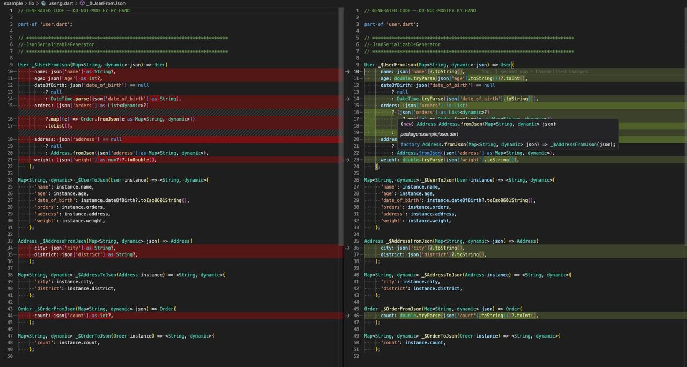

### flexible_json_serializable

Base on [package:json_serializable] and handle parsing JSON to objects without throwing exceptions.

#### Support types without exception (required nullable type)

[`BigInt`], [`bool`], [`DateTime`], [`double`],  [`int`],
[`List`], [`Map`], [`Object`], [`String`], [`Uri`]

#### Example

Left: json_serializable

Right: flexible_json_serializable

[`BigInt`]: https://api.dart.dev/stable/dart-core/BigInt-class.html
[`bool`]: https://api.dart.dev/stable/dart-core/bool-class.html
[`DateTime`]: https://api.dart.dev/stable/dart-core/DateTime-class.html
[`double`]: https://api.dart.dev/stable/dart-core/double-class.html
[`int`]: https://api.dart.dev/stable/dart-core/int-class.html
[`List`]: https://api.dart.dev/stable/dart-core/List-class.html
[`Map`]: https://api.dart.dev/stable/dart-core/Map-class.html
[`Object`]: https://api.dart.dev/stable/dart-core/Object-class.html
[`String`]: https://api.dart.dev/stable/dart-core/String-class.html
[`Uri`]: https://api.dart.dev/stable/dart-core/Uri-class.html
[package:json_serializable]: https://pub.dev/packages/json_serializable
